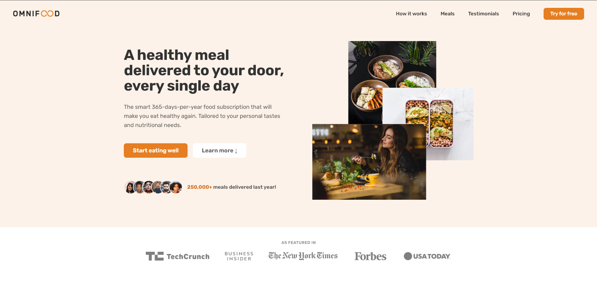
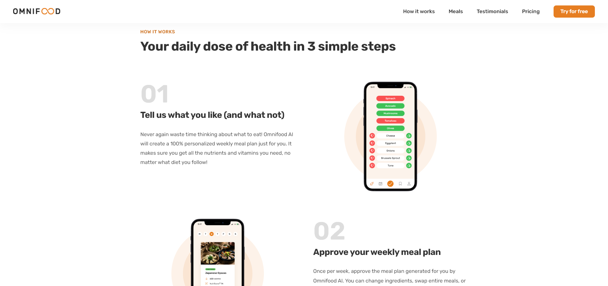
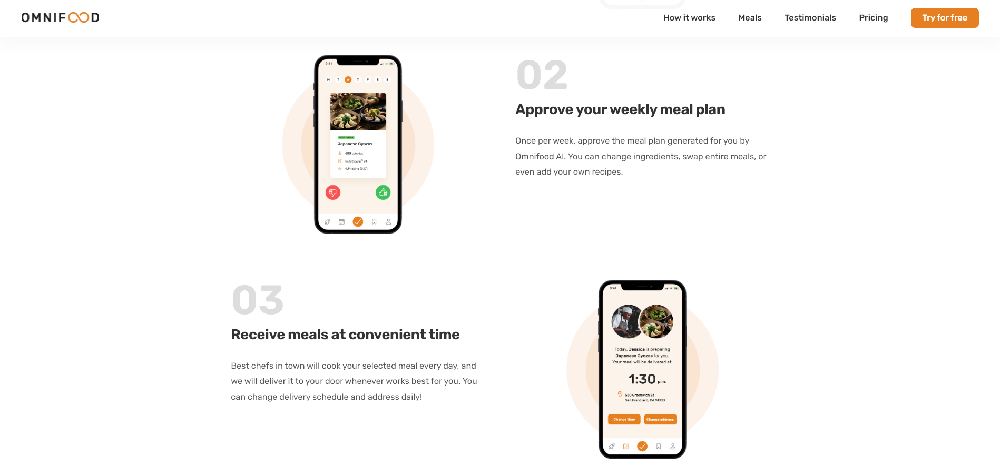
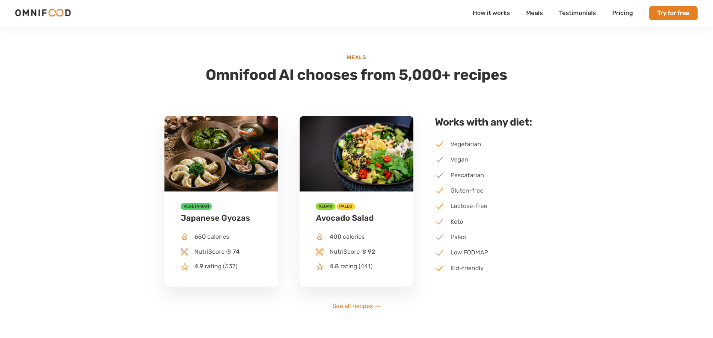
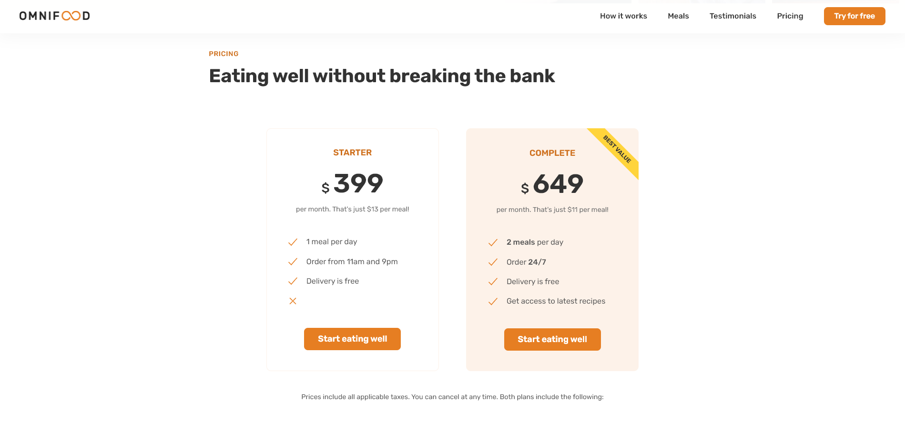
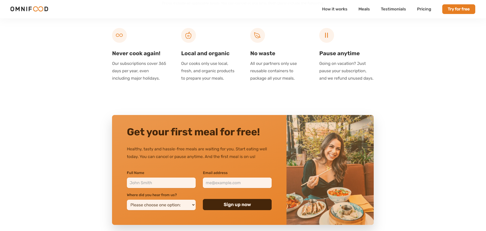

# 🥕 Omnifood

A food delivery website built using HTML/CSS and JS. I built this website as part of [Jonas Schmedtmann's](https://www.udemy.com/course/design-and-develop-a-killer-website-with-html5-and-css3/?couponCode=ST13MT40224) Udemy course. 

## 📦 Technologies Used

- `HTML`
- `CSS`
- `JavaScript`

## 📚 What I Learned

During Jonas' Udemy course on HTML and CSS, I gained proficiency in a wide range of topics including:

- **HTML Fundamentals**:
  Understanding the structure and semantics of HTML elements.

- **CSS Fundamentals**:
  Styled web pages using CSS selectors, properties, and values.

- **Layouts**:
  Learned about different layout techniques including Floats, Flexbox, and Grid.

- **Components and Layout Patterns**:
  Implemented reusable components and layout patterns for efficient web development.

- **Web Design Rules/Framework**:
  Explored design principles and frameworks to create visually appealing and user-friendly websites.

- **Responsive Web Design**:
  Implemented responsive design principles to make websites adapt to various screen sizes and devices.

- **Optimization**:
  Optimizing website performance by minimizing file sizes and other techniques to improve loading speed and user experience.

- **Deployment**:
  Deployed to the Netlify platform for easy hosting and form functionality.  

At the end of the course, we applied these concepts to build Omnifood, a food delivery website, using HTML, CSS, and JavaScript. This hands-on project allowed me to reinforce my understanding of the course material and gain practical experience in web development.

## 💭 How could it be improved?

- Add functionality to "See all recipes".
- Make CTA more modern and minimal.
- Improve the mobile navigation menu.
- Implement user accounts.

## 👨‍💻 Where can I view this website?

[Here!](https://omnifood-ljtommasi.netlify.app/)

## 📸 Screenshots

